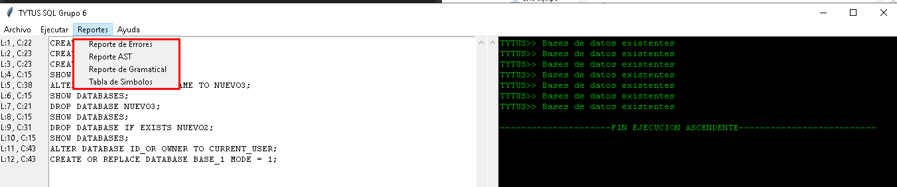
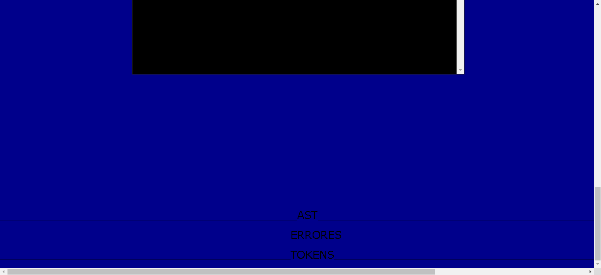

# Manual de Usuario - Proyecto 2
Juan Pablo García Monzon - 2012-22615

<b>Este proyecto necesita estos requerimientos para funcionar</b>

* Buscador (Chrome, Edge, etc)

* Windows 10, Linux, Mac

* Tener instalado NodeJS, Golang

* 1GB de RAM

* Si es la primera vez descargando este proyecto se recomienda dar un "npm install" especificamente en la carpeta "Java_JS" ya que aquí se encuentra todo el servidor de Backend de NodeJS

Flujo del proyecto

* Al abrir la aplicacion dar click primero en el botón "+" para agregar una nueva pestaña donde escribir.

* Dar click en el botón "Choose File" para poder buscar el archivo ".java" que se quiera analizar o escribir desde 0 un archivo java en el área de texto "JAVA"

* Luego dar click otra vez en el botón "+" y volver a la pestaña con el nombre del archivo que abrió donde se vera el texto.

* Luego dar click en el botón "Analizar" que esta en el botón de menú desplegable "Menú".

* Dar click en el botón "Descargar" y elegir el descargar la traducción del análisis.

* Dar click en el botón "Reportes" para poder ver los reportes como "AST", "Lista de Tokens" o "Tabla de Errores", estos se desplegaran dentro de la misma página un poco abajo.

* "Si no se reporto ningun error, la tabla de errores aparecera sin ningun contenido".
* Dar click en "Menu" "Guardar" o "Guardar Como" para guardar el archivo ".java" 

* Si da click en "Guardar Como" por favor escribir un nombre de archivo en la caja de texto identificada. 
